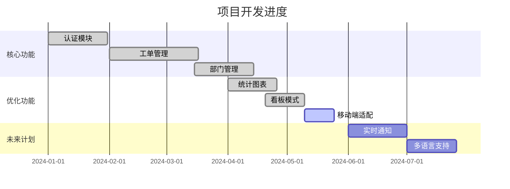

# 医院工单管理系统


基于Vue 3 + TypeScript + Vite构建的现代化工单管理系统，专门针对医疗信息科场景优化。

## ✨ 功能特性

### 核心功能
- **工单全流程管理**：创建、查看、编辑、处理、关闭工单
- **权限管理**：多角色访问控制（管理员、科主任、普通用户）
- **部门管理**：支持多科室/部门管理
- **统计分析**：可视化数据统计和图表展示

### 医院场景优化
- **医疗专属分类**：系统故障、设备报修、网络问题、软件需求、数据查询、账号问题
- **紧急优先级**：低、中、高、紧急四档优先级
- **状态跟踪**：待处理、处理中、已解决、已关闭

### 技术特性
- **现代化架构**：Vue 3 + TypeScript + Composition API
- **状态管理**：Pinia集中式状态管理
- **路由守卫**：完整的认证和权限控制
- **响应式设计**：适配桌面端和移动端
- **代码质量**：TypeScript强类型检查，ESLint + Prettier代码规范

## 🚀 快速开始

### 环境要求
- Node.js 20.19.0+ 或 22.12.0+
- npm 或 pnpm 或 yarn

### 安装依赖
```bash
npm install
```

### 环境配置
1. 复制环境变量文件：
```bash
cp .env.example .env
```

2. 配置环境变量：
```bash
# API 服务器地址
VITE_API_URL=http://localhost:8083

# 应用标题
VITE_APP_TITLE=工单管理系统
```

### 开发模式
```bash
npm run dev
```
应用将在 http://localhost:3500 启动

### 生产构建
```bash
npm run build
```
构建产物位于 `dist/` 目录

### 代码检查
```bash
# 类型检查
npm run type-check

# 代码格式化
npm run format

# ESLint检查
npm run lint
```

### 测试
```bash
# 运行测试
npm run test

# 测试覆盖率
npm run test:coverage

# 测试UI界面
npm run test:ui
```

## 📁 项目结构

```
src/
├── components/          # 可复用组件
│   ├── ticket/         # 工单相关组件
│   └── ui/             # 基础UI组件
├── composables/        # Vue组合式函数
├── router/             # 路由配置
├── services/           # API服务
│   └── api/           # API客户端和接口
├── stores/             # Pinia状态管理
├── types/              # TypeScript类型定义
├── utils/              # 工具函数
├── views/              # 页面组件
└── support/            # 支持的配置文件
```

## 🔧 配置选项

### 看板模式
系统支持两种访问模式：

1. **完整模式**（默认）
   - 完整的登录和权限验证
   - 多用户角色管理

2. **看板模式**
   - 免登录访问
   - 固定账号自动登录
   - 适合大屏展示或监控面板

配置方式：修改 `src/support/config.ts` 中的 `dashboardConfig`

### API配置
- 基础API地址：`VITE_API_URL` 环境变量
- 请求超时：30秒
- 自动错误重试

## 📊 工单管理

### 工单状态
- **pending**：待处理（默认）
- **progress**：处理中
- **resolved**：已解决
- **closed**：已关闭

### 工单优先级
- **low**：低
- **medium**：中
- **high**：高
- **urgent**：紧急

### 工单分类
- **system_failure**：系统故障
- **device_failure**：设备报修
- **network_issue**：网络问题
- **software_request**：软件需求
- **data_query**：数据查询
- **account_issue**：账号问题
- **other**：其他

## 🧪 测试

项目使用Vitest进行单元测试：

```bash
# 运行所有测试
npm run test

# 生成测试覆盖率报告
npm run test:coverage

# 使用测试UI界面
npm run test:ui
```

## 📚 文档

```bash
# 开发文档服务器
npm run docs:dev

# 构建文档
npm run docs:build

# 预览构建的文档
npm run docs:preview
```

## 🛠️ 开发指南

### 代码规范
- 使用TypeScript进行类型检查
- 遵循ESLint规范
- 使用Prettier格式化代码
- 遵循Vue 3 Composition API最佳实践

### 组件开发
1. 使用 `defineComponent` 定义组件
2. 使用Composition API组织逻辑
3. 为props和emits提供类型定义
4. 组件按功能分类存放

### 状态管理
- 使用Pinia进行状态管理
- 按业务领域划分store
- 使用TypeScript定义state类型
- 通过actions更新状态

### API集成
- 使用 `ApiClient` 基类封装HTTP请求
- 按业务模块划分API服务
- 统一的错误处理机制
- 请求/响应数据转换

## 🤝 贡献指南

1. Fork 项目
2. 创建功能分支 (`git checkout -b feature/AmazingFeature`)
3. 提交更改 (`git commit -m 'Add some AmazingFeature'`)
4. 推送到分支 (`git push origin feature/AmazingFeature`)
5. 提交Pull Request

## 📄 许可证

本项目采用私有许可证，未经许可不得复制和使用。

## 📞 支持与联系

如有问题或建议，请联系项目维护者。

## 📈 项目统计

### GitHub 数据

#### Star History


#### 项目活跃度


### 开发趋势


---

**构建现代医疗信息化管理系统**